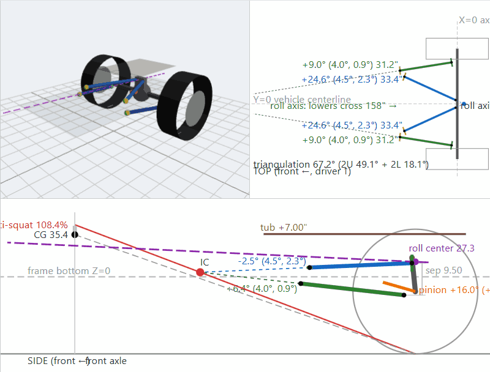

# fourlink

Design and check a rear 4-link suspension before you build it. Try it at **[fourlink.org](https://fourlink.org)**.

Enter your bracket locations and fourlink shows the geometry in 3D, top and side views and works out how it will behave: anti-squat, instant center, roll axis and roll steer, pinion change, joint misalignment and bridge-to-tub clearance. You see the numbers at ride height and anywhere in the travel range, including crossed-up articulation.

> **Check before you cut.** This is a geometry model, not a substitute for measuring and mocking up. Verify results before cutting or welding.

## What it tells you

- **Anti-squat** at ride height and through travel, across your CG height estimate. Target 100–110%.
- **Instant center and roll center** location.
- **Roll axis and roll steer**: how much the rear axle steers when it articulates.
- **Link geometry**: lengths, angles, upper/lower ratio, separation and triangulation, with guideline targets.
- **Pinion change**: how far the axle housing rotates through travel, for driveshaft planning.
- **Axle roll, rear steer and axle shift** (fore/aft and side to side) at any wheel position.
- **Joint misalignment** for each rod end, using how the bolt actually runs through each bracket, checked against the joint's rated limit. The worst case over the full travel range is reported, so you know whether a joint binds anywhere.
- **Bridge-to-tub clearance** through bump and flex.
- **Upper bracket hole comparison**: switch between upper frame bracket holes to tune anti-squat.

Anything over a limit is shown in red.

## Using it

1. Open the viewer at [fourlink.org](https://fourlink.org). It starts with an example Jeep rear 4-link.
2. On the **Data entry** tab, enter your measurements and click **Apply**. Hover any field for what to measure and what it affects. **Save YAML** keeps your setup; **Load YAML** brings it back.
3. On the **Calculations** tab, pick the upper frame bracket hole and CG height, then drag the driver and passenger travel sliders to pose the axle. Tick **Lock sides** for straight bump and droop. Hover any result for what it means; the related part of the drawing lights up.

## Measuring

All points are in inches, in one coordinate system fixed to the frame:

| Axis | Zero | + direction |
|---|---|---|
| X | Rear axle centerline | Forward |
| Y | Vehicle centerline | Driver side (passenger side is mirrored) |
| Z | Bottom of the frame rail | Up |

Measure each point against the part it is welded to, so nothing depends on ride height:

| YAML section | Points | Entered as |
|---|---|---|
| `axle` | UA, LA, bridge top | [X, Y, height above axle center] |
| `frame` | LF, UF holes, tub floor | [X, Y, Z above frame bottom] |

Frame height (`vehicle.frame_height`, ground to frame bottom) and tire radius (`vehicle.tire_radius`, ground to axle center) tie the two together. Change frame height to see a lift or a different ride height: the axle and everything on it move with it.

For each joint, set how the bolt runs through the bracket in `joints.bolt`: `horizontal` for a typical tab bracket (angle = where the bracket aims the link in the top view, + inboard) or `vertical` (angle = tilt of the bolt top toward the link's other end). Misalignment is measured against that bolt.

## Running locally

See [DEVELOPMENT.md](DEVELOPMENT.md) for running the viewer locally and the command-line tools.

## License

[MIT](LICENSE).
